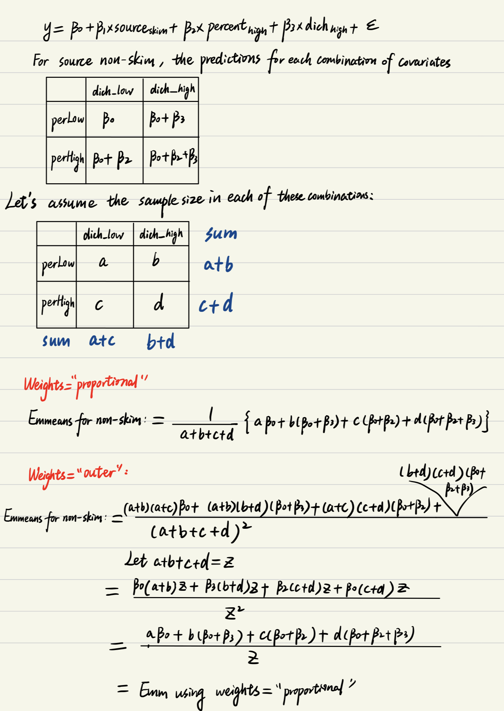

```{r setup, include=FALSE}
knitr::opts_chunk$set(echo = TRUE)
library(tidyverse)
library(emmeans)
library(readxl)
library(writexl)
```

## Pigs data
```{r}
data(pigs)
set.seed(123)
bound <- mean(pigs$conc)

pigs_df <- pigs %>%
  mutate(
    dich = factor(case_when(
      conc <= bound ~ "Low",
      TRUE ~ "High"), 
      levels = c("Low", "High")
    ),
    source = factor(case_when(
      source == "skim" ~ "skim",
      TRUE ~ "non-skim")
    ),
    source_num = as.numeric(source == "non-skim"),
    noise = rnorm(n(), mean = 0, sd = 1),
    x = 1 * source_num + 0.5 * conc + noise
  ) %>% 
  select(source, x, percent, conc, dich)

saveRDS(pigs_df, file = "data/pigs_modified.rds")
write_csv(pigs_df, "data/pigs_modified.csv")

# data <- readRDS(file = "pigs_modified.rds")
# write_csv(pigs, "pigs.csv")
```

## Unadjusted mean
```{r}
## Let emmeans output more digits
emm_options(opt.digits = FALSE)

## Our test data
pigs_df

mod_unadjusted <- lm(conc ~ source, data = pigs_df)
summary(mod_unadjusted)
emmeans(mod_unadjusted, "source", infer = TRUE, null = 0)
```

### Calculate by ourselves

$$y = 34.35 + 9.794 * source_{skim} + \varepsilon$$
```{r}
## EMM for source non-skim
34.35
## EMM for source skim
34.35 + 9.794

# Raw marginal means of the data
with(pigs_df, tapply(conc, source, mean))
```

The unadjusted mean, is just the raw marginal mean.

## Adjusted mean
```{r}
mod_1 <- lm(conc ~ source + x + factor(percent) + dich, data = pigs_df)
summary(mod_1)

EMM_equal <- emmeans(mod_1, "source", weights = "equal", infer = TRUE, null = 0)
EMM_equal
contrast(EMM_equal, method = "revpairwise", infer = TRUE)

EMM_flat <- emmeans(mod_1, "source", weights = "flat", infer = TRUE, null = 0)
EMM_flat
contrast(EMM_flat, method = "revpairwise", infer = TRUE)

EMM_prop <- emmeans(mod_1, "source", weights = "proportional", infer = TRUE, null = 0)
EMM_prop
contrast(EMM_prop, method = "revpairwise", infer = TRUE)

EMM_outer <- emmeans(mod_1, "source", weights = "outer", infer = TRUE, null = 0)
EMM_outer
contrast(EMM_outer, method = "revpairwise", infer = TRUE)
# emmeans(mod_1, c("source", "percent"), weights = "prop") %>% emmeans("source", weights = "prop")
```

<br>

Table for emmeans of model `conc ~ source + x + factor(percent) + dich` using different weights 

| Emmeans  | weights="equal" | weights="prop" | weights="outer" |
|----------|-----------------|----------------|-----------------|
| non-skim | 36.26182        | 36.09759       | 36.09759        |
| skim     | 40.42513        | 40.26090       | 40.26090        |

In this linear model without interactions, using weights = "proportional" seems to give the same emmeans as using weights = "outer"

### Calculate by ourselves

$$y = 3.72477 + 4.16331*source_{skim} + 1.59508x + 0.01478*percent_{12} - 0.07722*percent_{15} \\+ 2.6349*percent_{18} + 2.24182*dich_{high} + \varepsilon$$

```{r}
# ref_grid creates an `emmGrid` class object
ref_grid(mod_1)

# data.frame contains the combinations of the variables that define the reference grid. In addition, there is an auxiliary column named ".wgt." holding the observed frequencies (or weights) for each factor combination (excluding covariates).
ref_grid(mod_1)@grid

# matrix. Each row consists of the linear function of the regression coefficients for predicting its corresponding element of the reference grid. The rows of this matrix go in one-to-one correspondence with the rows of grid above, and the columns with elements of bhat.
xs_mx <- ref_grid(mod_1)@linfct
xs_mx

# numeric. The regression coefficients
beta_vec <- ref_grid(mod_1)@bhat
beta_vec

# predictions for every combination of the variables
pred <- xs_mx %*% beta_vec
pred

# Frequencies of each combination of covariates in the dataset
addmargins(with(pigs_df, table(percent, dich)), margin = 1:2)


# ---------- Get the "outer" weights for calculating emmeans ----------
observed <- with(pigs_df, table(percent, dich))

## Row, column and grand totals
row_totals <- apply(observed, 1, sum)
col_totals <- apply(observed, 2, sum)
grand_total <- sum(observed)

## Calculating "expected frequencies" and outer weights
expected <- outer(row_totals, col_totals)
outer_wts <- expected/sum(expected)
outer_wts

# Get the "flat" weights
ref_grid(mod_1)@grid %>%
  rename(sample_size = .wgt.) %>% 
  group_by(source) %>% 
  mutate(weights = if_else(sample_size != 0, 1/sum(sample_size != 0), 0)) %>% 
  as.data.frame()

# Get the "equal" weights
observed <- with(pigs_df, table(percent, dich))
eq_wt <- 1/(nrow(observed)*ncol(observed))
eqwt_df <- observed
eqwt_df[] <- eq_wt
eqwt_df

# Get the "proportional" weights
addmargins(with(pigs_df, table(percent, dich)), margin = 1:2)/29
```

Calculating emmeans using weights="equal":
```{r}
eqwt_nonskim <- c(1/8, 0, 1/8, 0, 1/8, 0, 1/8, 0, 1/8, 0, 1/8, 0, 1/8, 0, 1/8, 0)
eqwt_skim <- c(0, 1/8, 0, 1/8, 0, 1/8, 0, 1/8, 0, 1/8, 0, 1/8, 0, 1/8, 0, 1/8)
## Emmeans for non-skim using weights="equal" (default)
eqwt_nonskim %*% pred
## Emmeans for skim using weights="equal" (default)
eqwt_skim %*% pred
```

Calculating emmeans using weights="flat":
```{r}
ftwt_nonskim <- c(1/8, 0, 1/8, 0, 1/8, 0, 1/8, 0, 1/8, 0, 1/8, 0, 1/8, 0, 1/8, 0)
ftwt_skim <- c(0, 1/5, 0, 0, 0, 0, 0, 0, 0, 1/5, 0, 1/5, 0, 1/5, 0, 1/5)
## Emmeans for non-skim using weights="flat"
ftwt_nonskim %*% pred
## Emmeans for skim using weights="flat"
ftwt_skim %*% pred
```

Calculating emmeans using weights="proportional":
```{r}
prop_nonskim <- c(6/29, 0, 3/29, 0, 2/29, 0, 3/29, 0, 2/29, 0, 6/29, 0, 5/29, 0, 2/29, 0)
prop_skim <- c(0, 6/29, 0, 3/29, 0, 2/29, 0, 3/29, 0, 2/29, 0, 6/29, 0, 5/29, 0, 2/29)
## Emmeans for non-skim using weights="proportional"
prop_nonskim %*% pred
## Emmeans for skim using weights="proportional"
prop_skim %*% pred
```

Calculating emmeans using weights="outer":
```{r}
outerwt_nonskim <- c(0.13317479, 0, 0.14982164, 0, 0.11652794, 0, 0.08323424, 0, 0.14268728, 0, 0.16052319, 0, 0.12485137, 0, 0.08917955, 0)
outerwt_skim <- c(0, 0.13317479, 0, 0.14982164, 0, 0.11652794, 0, 0.08323424, 0, 0.14268728, 0, 0.16052319, 0, 0.12485137, 0, 0.08917955)
## Emmeans for non-skim using weights="outer"
outerwt_nonskim %*% pred
## Emmeans for skim using weights="outer"
outerwt_skim %*% pred
```

Our hand-calculated results match those from `emmeans()` function. **All of the above 3 weights for the `source` (exposed group and unexposed group) are the same. So they are all adjusted means.**

### Weights "prop" vs "outer"

In this case of linear model without interactions, I think we can prove emmeans using wights="proportional" and weights="outer" are the same. Let's imagine a model with 1 binary primary predictor and 2 binary covariates:

$$y = \beta_0 + \beta_1*source_{skim} + \beta_2*percent_{high} + \beta_3dich_{high} + \varepsilon$$
Emmeans for source using wights="proportional":



and similarly for emmeans for source skim.

This proof can be extended to other linear models (with more covariates) without interactions.


## Using model with interaction

### Model `conc ~ source + x + factor(percent)*dich`

```{r}
mod_2 <- lm(conc ~ source + x + factor(percent)*dich, data = pigs_df)
summary(mod_2)

EMM_equal2 <- emmeans(mod_2, "source", weights = "equal", infer = TRUE, null = 0)
EMM_equal2
contrast(EMM_equal2, method = "revpairwise", infer = TRUE)

EMM_flat2 <- emmeans(mod_2, "source", weights = "flat", infer = TRUE, null = 0)
EMM_flat2
contrast(EMM_flat2, method = "revpairwise", infer = TRUE)

EMM_prop2 <- emmeans(mod_2, "source", weights = "proportional", infer = TRUE, null = 0)
EMM_prop2
contrast(EMM_prop2, method = "revpairwise", infer = TRUE)

EMM_outer2 <- emmeans(mod_2, "source", weights = "outer", infer = TRUE, null = 0)
EMM_outer2
contrast(EMM_outer2, method = "revpairwise", infer = TRUE)
```

<br>

Table for emmeans of model `conc ~ source + x + factor(percent)*dich` using different weights 

| Emmeans  | weights="equal" | weights="prop" | weights="outer" |
|----------|-----------------|----------------|-----------------|
| non-skim | 36.17009        | 36.12344       | 35.99725        |
| skim     | 40.25012        | 40.20347       | 40.07728        |

When we have interactions between the 2 categorical covariates, the emmeans obtained using weights="proportional" are different from using weights="outer".


### Calculate by ourselves

$$y = 4.1135 + 4.08*source_{skim} + 1.5908x - 0.3075*percent_{12} - 1.0615*percent_{15} + 2.1828*percent_{18}\\ + 1.1009*dich_{high} + 1.2096*percent_{12}*dich_{high} + 2.1349*percent_{15}*dich_{high} \\
+ 1.5554*percent_{18}*dich_{high} + \varepsilon$$

```{r}
# ref_grid creates an `emmGrid` class object
ref_grid(mod_2)

# data.frame contains the combinations of the variables that define the reference grid. In addition, there is an auxiliary column named ".wgt." holding the observed frequencies (or weights) for each factor combination (excluding covariates).
ref_grid(mod_2)@grid

# matrix. Each row consists of the linear function of the regression coefficients for predicting its corresponding element of the reference grid. The rows of this matrix go in one-to-one correspondence with the rows of grid above, and the columns with elements of bhat.
xs_mx <- ref_grid(mod_2)@linfct
xs_mx

# numeric. The regression coefficients
beta_vec <- ref_grid(mod_2)@bhat
beta_vec

# predictions for every combination of the variables
pred <- xs_mx %*% beta_vec

# Frequencies of each combination of covariates in the dataset
addmargins(with(pigs_df, table(percent, dich)), margin = 1:2)


# ---------- Get the "outer" weights for calculating emmeans ----------
observed <- with(pigs_df, table(percent, dich))

## Row, column and grand totals
row_totals <- apply(observed, 1, sum)
col_totals <- apply(observed, 2, sum)
grand_total <- sum(observed)

## Calculating "expected frequencies" and outer weights
expected <- outer(row_totals, col_totals)
outer_wts <- expected/sum(expected)
outer_wts
```

Calculating emmeans using weights="equal":
```{r}
eqwt_nonskim <- c(1/8, 0, 1/8, 0, 1/8, 0, 1/8, 0, 1/8, 0, 1/8, 0, 1/8, 0, 1/8, 0)
eqwt_skim <- c(0, 1/8, 0, 1/8, 0, 1/8, 0, 1/8, 0, 1/8, 0, 1/8, 0, 1/8, 0, 1/8)
## Emmeans for non-skim using weights="equal" (default)
eqwt_nonskim %*% pred
## Emmeans for skim using weights="equal" (default)
eqwt_skim %*% pred
```

Calculating emmeans using weights="proportional":
```{r}
prop_nonskim <- c(6/29, 0, 3/29, 0, 2/29, 0, 3/29, 0, 2/29, 0, 6/29, 0, 5/29, 0, 2/29, 0)
prop_skim <- c(0, 6/29, 0, 3/29, 0, 2/29, 0, 3/29, 0, 2/29, 0, 6/29, 0, 5/29, 0, 2/29)
## Emmeans for non-skim using weights="proportional"
prop_nonskim %*% pred
## Emmeans for skim using weights="proportional"
prop_skim %*% pred
```

Calculating emmeans using weights="outer":
```{r}
outerwt_nonskim <- c(0.13317479, 0, 0.14982164, 0, 0.11652794, 0, 0.08323424, 0, 0.14268728, 0, 0.16052319, 0, 0.12485137, 0, 0.08917955, 0)
outerwt_skim <- c(0, 0.13317479, 0, 0.14982164, 0, 0.11652794, 0, 0.08323424, 0, 0.14268728, 0, 0.16052319, 0, 0.12485137, 0, 0.08917955)
## Emmeans for non-skim using weights="outer"
outerwt_nonskim %*% pred
## Emmeans for skim using weights="outer"
outerwt_skim %*% pred
```

Our hand-calculated results match those from `emmeans()` function.

### Model `conc ~ source + x*factor(percent) + dich`
```{r}
mod_3 <- lm(conc ~ source + x*factor(percent) + dich, data = pigs_df)
summary(mod_3)

EMM_equal3 <- emmeans(mod_3, "source", weights = "equal", infer = TRUE, null = 0)
EMM_equal3
contrast(EMM_equal3, method = "revpairwise", infer = TRUE)

EMM_prop3 <- emmeans(mod_3, "source", weights = "proportional", infer = TRUE, null = 0)
EMM_prop3
contrast(EMM_prop3, method = "revpairwise", infer = TRUE)

EMM_outer3 <- emmeans(mod_3, "source", weights = "outer", infer = TRUE, null = 0)
EMM_outer3
contrast(EMM_outer3, method = "revpairwise", infer = TRUE)
```

In this model where a categorical covariate interacts with a continuous covariate, using weights = "proportional" gives the same emmeans as using weights = "outer"

### Calculate by ourselves
```{r}
# ref_grid creates an `emmGrid` class object
ref_grid(mod_3)

# data.frame contains the combinations of the variables that define the reference grid. In addition, there is an auxiliary column named ".wgt." holding the observed frequencies (or weights) for each factor combination (excluding covariates).
ref_grid(mod_3)@grid

# matrix. Each row consists of the linear function of the regression coefficients for predicting its corresponding element of the reference grid. The rows of this matrix go in one-to-one correspondence with the rows of grid above, and the columns with elements of bhat.
xs_mx <- ref_grid(mod_3)@linfct
xs_mx

# numeric. The regression coefficients
beta_vec <- ref_grid(mod_3)@bhat
beta_vec

# predictions for every combination of the variables
pred <- xs_mx %*% beta_vec

# Frequencies of each combination of covariates in the dataset
addmargins(with(pigs_df, table(percent, dich)), margin = 1:2)

# the "outer" weights for calculating emmeans
outer_wts
```

Calculating emmeans using weights="equal":
```{r}
eqwt_nonskim <- c(1/8, 0, 1/8, 0, 1/8, 0, 1/8, 0, 1/8, 0, 1/8, 0, 1/8, 0, 1/8, 0)
eqwt_skim <- c(0, 1/8, 0, 1/8, 0, 1/8, 0, 1/8, 0, 1/8, 0, 1/8, 0, 1/8, 0, 1/8)
## Emmeans for non-skim using weights="equal" (default)
eqwt_nonskim %*% pred
## Emmeans for skim using weights="equal" (default)
eqwt_skim %*% pred
```

Calculating emmeans using weights="proportional":
```{r}
prop_nonskim <- c(6/29, 0, 3/29, 0, 2/29, 0, 3/29, 0, 2/29, 0, 6/29, 0, 5/29, 0, 2/29, 0)
prop_skim <- c(0, 6/29, 0, 3/29, 0, 2/29, 0, 3/29, 0, 2/29, 0, 6/29, 0, 5/29, 0, 2/29)
## Emmeans for non-skim using weights="proportional"
prop_nonskim %*% pred
## Emmeans for skim using weights="proportional"
prop_skim %*% pred
```

Calculating emmeans using weights="outer":
```{r}
outerwt_nonskim <- c(0.13317479, 0, 0.14982164, 0, 0.11652794, 0, 0.08323424, 0, 0.14268728, 0, 0.16052319, 0, 0.12485137, 0, 0.08917955, 0)
outerwt_skim <- c(0, 0.13317479, 0, 0.14982164, 0, 0.11652794, 0, 0.08323424, 0, 0.14268728, 0, 0.16052319, 0, 0.12485137, 0, 0.08917955)
## Emmeans for non-skim using weights="outer"
outerwt_nonskim %*% pred
## Emmeans for skim using weights="outer"
outerwt_skim %*% pred
```

The hand-calculated results align with the results from `emmeans` function.